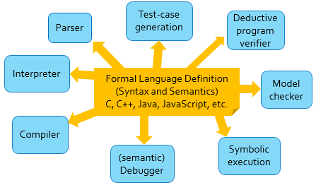

\newcommand {\K} {$\mathbb{K}$ }

-   Motivation (Why reimplement dafny in K)
    -   Semantics-first approach
    -   Avoids translation to Boogie
    -   Towards a language-agnostic framework for verification via
        > invariants
    -   Xxx something about how rewriting is easy to understand??
-   Implementation
    -   What subset of Dafny do we implement
    -   Explain a few of the rules (main, if, while, assert, \#abstract,
        > assume)
-   Future work
    -   Expanding the subset of dafny we handle
    -   Sharing a definition for both execution and verification
    -   Making this language agnostic
    -   Inferring invariants

Abstract
========

In this paper we will present an implementation of verification over a
fragment of the Dafny programming language in the K Framework.

Introduction
============

## What is Dafny?

The Dafny language provides a familiar programming environment to
developers new to writing automatically verified code. It borrows from
the imperative and functional styles \[Cite: Dafny website\], augmented
with loop invariants, pre/post-condition annotations, and assert/assume
statements to specify the correctness properties of a program, and
assist a mechanical prover in verifying these properties. Dafny
automatically generates proofs of a program's correctness and (usually)
termination \[Cite: Dafny tutorial\]. But the native Dafny tools have
some significant disadvantages in complexity and language dependence,
and doubts of the cross validity between Dafny execution and Dafny
verification. \[TODO: Nishant - expand about differences in
execution/verification?\]. This may also prove a difficulty for
programmers unfamiliar with verification attempting to debug a Dafny
program. To remedy these issues, we create an proof of concept
operational semantics for Dafny using the \K Framework.

## What is \K?

The \K Framework is a tool for creating executable semantics for programming
languages, and, from these semantic specifications, generating a variety of
formal analysis tools. \K generates a parser, interpreter, and deductive verifier
automatically from a given definition. It provides facilities for both concrete
and symbolic execution, and debugging tools for validating a definition.
Generating these tools from the same ultimate source provides a sense of
confidence in their consistency and avoids unnecessary duplicate work. Rewrite
rules provide an intuitive and highly expressive language for defining
specifications, allowing people without formal logic training to create and
verify specifications. [Cite KEVM Paper & K Website as sources]



K semantics have been created even for languages as large as C, C~\cite{ellison2012executable}~\cite{hathhorn-ellison-rosu-2015-pldi}, Java~\cite{bogdanas-rosu-2015-popl} and JavaScript~\cite{park-stefanescu-rosu-2015-pldi}, among others. [TODO: Maybe mention new languages like KEVM itself]

## Motivation

-   Motivation (Why reimplement dafny in K)
    -   Semantics-first approach
    -   Avoids translation to Boogie
    -   Towards a language-agnostic framework for verification via
        > invariants
    -   Xxx something about how rewriting is easy to understand??

## Implementation

### What subset of Dafny do we implement

### Explain a K definition, a few of the rules (main, if, while, assert, #abstract, assume)

TODO: Steal from section 3 from KEVM paper

The main components of a \K definition are:

1.  a set of syntactic elements of the programming language,
2.  a configuration encapsulating all of the state and context that can impact
    the execution of a program,
3.  and a set of rewrite rules.

A rewrite rule is a pair of patterns over language constructs, including
variables over syntax items (such as Ints, Strings, etc that may appear in the
AST). These rewrite rules can also include parts of the language configuration.
A rewrite rule contains a pair of these patterns, one to match and one to
rewrite to. When a rule is applied, elements of the rule match with the current
configuration of the program, assigning values to variables contained in the
rules. Once a full match is completed, the the right hand side of the rule is
used to construct the next state of the program using the values for variables
defined on the left hand side. As an example:

```k
<k> S1:Stmt ; Ss:Stmts => S1 ~> Ss </k>
```

// The \`k\` cell is traditionally used to hold the program text under
test.

Is a typical rule specifying sequential composition of a list of Stmt
syntax item (statements in the programming language), which are
separated by semicolons. This rule separates the leftmost statement,
nearest to the top of the configuration from the remainder of the list.
This statement can now be matched in future rules which will cause it to
mutate program state or produce an output. Eventually, if the program
under test terminates, the contents of the K cell will rewrite to
nothing. The sequence of rewrite rule applications from the initial
state of the program to the final empty state constitutes an execution
of a program under a K semantics.

## Future work


### Expanding the subset of dafny we implement

The obvious direction forward is to extend the fragment of dafny programs that
we can prove partial correctness. A first step in this direction would be to
support verification of top-level methods and method calls, additional types
such as `nat`s and arrays. Verification of invariants involving arrays pose a
challenge that may need aditional insight, since it often requires
quantification over array indices. In the long run, we'd like to support the
plethora of dafny paradigms including algebraic and co-algebraic data types,
classes, ghost variables and heap reasoning.

### Termination

Another important avenue to persue is to extend verification to prove termination
via Dafny's `decreases` sepecifications.

### Sharing a definition for both execution and verification
### Making this language agnostic
### Inferring invariants

Our current definition specifies an operational semantics for Dafny's
verification. It does this by giving a verification-specific semantics to
constructs, such as loops, who's execution semantics would involve fixed-points.
In an ideal world, this verification semantics should be derivable from the
execution semantics.

```
syntax Statement ::= "while" "(" Exp ")" "invariant" Exp "{" Statements "}"
rule <k> while (B) invariant INV { S }
      => assert(INV) ;
         #abstract ;
         #assume(INV);
         #save
         if (B) { S ; assert (INV) ;
                  #subsumed? ;
                  while (B) invariant INV { S }
                }
         ...
     </k>
```

Here, the semantics of `#abstract` is that it is *any* monotonic function that
replaces the configuration $C$ with another (symbolic) configuration $C'$ such
that $C -> C'$. The original configuration $C$ is saved as an "abstraction
point". `#subsume?` will check if the current configuration implies the
saved abstraction point. If it does, then we prune that trace. This
is sound for partial correctness. Otherwise, it will replace the abstraction point
with `#abstract(C \/ C')` where $C$ is the configuration at the abstraction
point and $C'$ is the current configuration and continue exectution.

In the case of concrete exectution, we can instantiate `#abstract` to the
identity function. The previous implementation for while loops can be thought of
as instantiating `#abstract` with a function replacing the configuration cells
(besides the `k` cell) with a fresh symbolic configuration that satisfies the
invariant.

We can also have `#abstract` replace each variable's value with the weakest
pattern that holds from a set of patterns that form a complete partial order of
finite height (e.g. isInteger, isPositive, isNonNegative... isZero, false; or
odd/even/top.) Since the partial order of finite height we must eventually
converge at some fixed point. This fixed point is in fact an invariant of the
loop.

So, from the same semantics, we can get concrete execution, invariant checking
as well as infer new invariants.

## Conclusion
