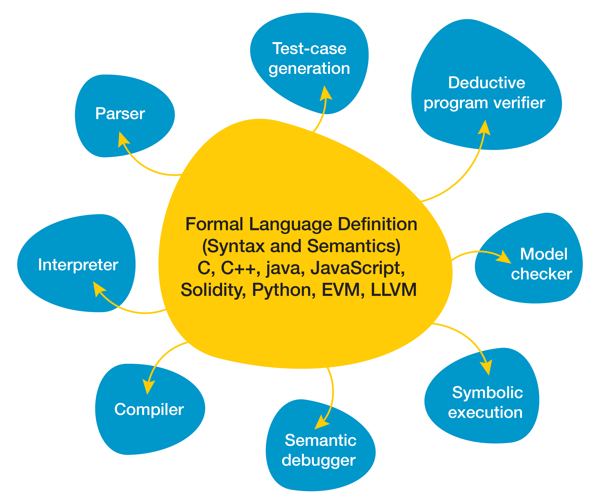

\newcommand {\K} {$\mathbb{K}$ }

-   Motivation (Why reimplement dafny in K)
    -   Semantics-first approach
    -   Avoids translation to Boogie
    -   Towards a language-agnostic framework for verification via
        > invariants
    -   Xxx something about how rewriting is easy to understand??
-   Implementation
    -   What subset of Dafny do we implement
    -   Explain a few of the rules (main, if, while, assert, \#abstract,
        > assume)
-   Future work
    -   Expanding the subset of dafny we handle
    -   Sharing a definition for both execution and verification
    -   Making this language agnostic
    -   Inferring invariants

Abstract
========

In this paper we will present an implementation of verification over a
fragment of the Dafny programming language in the K Framework.

Introduction
============

## What is Dafny?

The Dafny language provides a familiar programming environment to
developers new to writing automatically verified code. It borrows from
the imperative and functional styles \[Cite: Dafny website\], augmented
with loop invariants, pre/post-condition annotations, and assert/assume
statements to specify the correctness properties of a program, and
assist a mechanical prover in verifying these properties. Dafny
automatically generates proofs of a program's correctness and (usually)
termination \[Cite: Dafny tutorial\]. But the native Dafny tools have
some significant disadvantages in complexity and language dependence,
and doubts of the cross validity between Dafny execution and Dafny
verification. \[Nishant - expand about differences in
execution/verification?\]. This may also prove a difficulty for
programmers unfamiliar with verification attempting to debug a Dafny
program. To remedy these issues, we create an proof of concept
operational semantics for Dafny using the K Framework.

## What is K?

The \K Framework is a rewriting based framework for defining executable semantic
specifications of programming languages, type systems and formal analysis tools.
Given the syntax and semantics of a language, \K generates a parser, an
interpreter, as well as formal methods analysis tools such as a model checker
and a deductive verifier. This avoids duplication while improving efficiency and
consistency. For example, using the interpreter, one can test the semantics
immediately, which significantly increases the efficiency of and confidence in
semantics development. The verifier uses the same internal model for verifying
programs, and that confidence carries over. Verification is discussed in
section\~\ref{sec:verification}
and\~\cite{stefanescu-park-yuwen-li-rosu-2016-oopsla}.

There exists a rich literature on using \K for defining languages, including an online tutorial~\cite{k-tutorial-url}.
 \K has been used to formalize large languages like C~\cite{ellison2012executable}~\cite{hathhorn-ellison-rosu-2015-pldi}, Java~\cite{bogdanas-rosu-2015-popl} and JavaScript~\cite{park-stefanescu-rosu-2015-pldi}, among others.
We will introduce \K by need, as we discuss our formalization.

## What is Semantics-first approach

The K Framework is a tool for defining programming languages by writing
an operational semantics for the language. This operational semantic
definition takes the form of a set of syntactic elements of the
programming language, a configuration encapsulating all of the state and
context that can impact the execution of a program, and a set of rewrite
rules. A rewrite rule is a pair of patterns over language constructs,
including variables over syntax items (such as Ints, Strings, etc that
may appear in the AST). These rewrite rules can also include parts of
the language configuration. A rewrite rule contains a pair of these
patterns, one to match and one to rewrite to. When a rule is applied,
elements of the rule match with the current configuration of the
program, assigning values to variables contained in the rules. Once a
full match is completed, the the right hand side of the rule is used to
construct the next state of the program using the values for variables
defined on the left hand side. As an example:

\<k\> S1:Stmt ; Ss:Stmts =\> S1 \~\> Ss \</k\>

// The \`k\` cell is traditionally used to hold the program text under
test.

Is a typical rule specifying sequential composition of a list of Stmt
syntax item (statements in the programming language), which are
separated by semicolons. This rule separates the leftmost statement,
nearest to the top of the configuration from the remainder of the list.
This statement can now be matched in future rules which will cause it to
mutate program state or produce an output. Eventually, if the program
under test terminates, the contents of the K cell will rewrite to
nothing. The sequence of rewrite rule applications from the initial
state of the program to the final empty state constitutes an execution
of a program under a K semantics.

-   Motivation (Why reimplement dafny in K)
    -   Semantics-first approach
    -   Avoids translation to Boogie
    -   Towards a language-agnostic framework for verification via
        > invariants
    -   Xxx something about how rewriting is easy to understand??
-   Implementation
    -   What subset of Dafny do we implement
    -   Explain a few of the rules (main, if, while, assert, \#abstract,
        > assume)
-   Future work
    -   Expanding the subset of dafny we handle
    -   Sharing a definition for both execution and verification
    -   Making this language agnostic
    -   Inferring invariants
-   Conclusion
